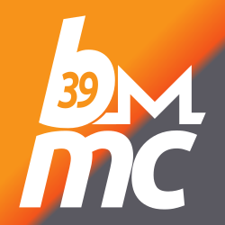

## BIP39 Monero mnemonic converter



Convert your English BIP39 mnemonic into a 25-word Monero mnemonic according to the SLIP-0010 standard.

⚠️ WARNING ⚠️ Your mnemonic is valuable information, enter it only if you absolutely need to and you know what you are doing. (For example, recovering a Trezor Monero wallet without a Trezor, or converting a BIP85 child mnemonic.) Ask a friend if unsure. Use this program only on a computer you trust and disconnect it from the internet.

### Dev setup

#### prerequisites

##### Arch-based

`python python-poetry`

##### Debian-based

`python3 python3-pip python3-venv libpython<ver>-dev`

Substitute your python version, 3.9 or newer should be fine.
The packaged version of poetry is too old, so it needs to be installed via pip.

```shell
python3 -m venv .venv
source .venv/bin/activate
pip install poetry # for debian-based systems
poetry install
```
